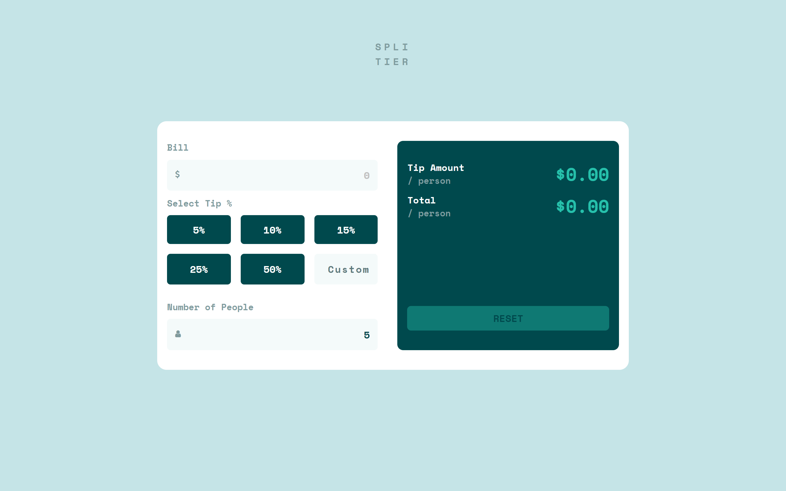

# Frontend Mentor - Tip calculator app solution

This is a solution to the [Tip calculator app challenge on Frontend Mentor](https://www.frontendmentor.io/challenges/tip-calculator-app-ugJNGbJUX). Frontend Mentor challenges help you improve your coding skills by building realistic projects.

## Table of contents

- [Overview](#overview)
  - [The challenge](#the-challenge)
  - [Screenshot](#screenshot)
  - [Links](#links)
  - [Built with](#built-with)
- [Author](#author)

## Overview

### The challenge

Users should be able to:

- View the optimal layout for the app depending on their device's screen size
- See hover states for all interactive elements on the page
- Calculate the correct tip and total cost of the bill per person

### Screenshot

### Links

- Solution URL: [https://www.frontendmentor.io/solutions/tip-calculator-app-nufnyO-qiF](https://www.frontendmentor.io/solutions/tip-calculator-app-nufnyO-qiF)
- Live Site URL: [https://rahulrajput83.github.io/tip-calculator-app/](https://rahulrajput83.github.io/tip-calculator-app/)

### Built with

- HTML
- CSS
- JavaScript

## Author

- Website - [Portfolio](https://rahulrajput83-portfolio.vercel.app/)
- Frontend Mentor - [@rahulrajput83](https://www.frontendmentor.io/profile/rahulrajput83)
- Linkedin - [@rahulrajput83](https://www.linkedin.com/in/rahulrajput83/)
- Twitter - [@rahulrajput83](https://twitter.com/rahulrajput_83)